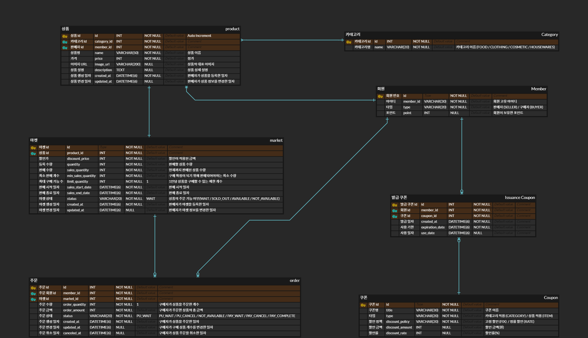

# 공구일상(0913) 마켓

## 요구사항 정의서

## ERD

## 패키지 구조
### **0913market**

- **market-domain** : 엔티티, DB 설정 정보, 비즈니스 로직 관련 모듈
    - config
    - model
        - category : 카테고리 엔티티
        - market : 마켓 엔티티
        - member : 회원 엔티티
        - order : 주문 엔티티
        - product : 상품 엔티티
    - service
    - repository
- **market-api** : Swagger2 설정, API 관련 모듈
    - config
    - controller
        - requestDto
        - responseDto
- **market-batch** : 주문 및 마켓 상태값 변경 배치 모듈
    - job
        - step

## Wiki
[서비스 용어 정의](https://github.com/f-lab-edu/0913market/wiki/%EC%84%9C%EB%B9%84%EC%8A%A4-%EC%9A%A9%EC%96%B4)